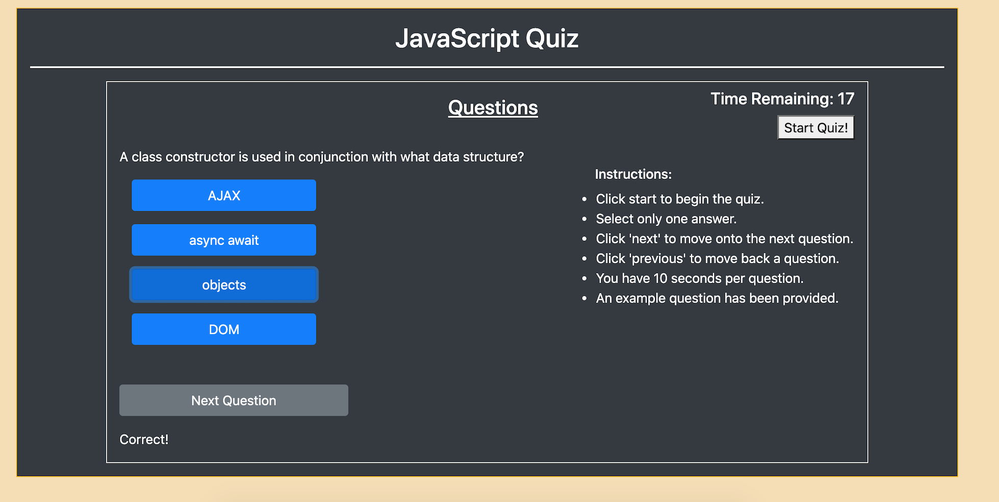

# code-quiz

### Screenshot of application:

### Instructions:
* Click start to begin the quiz.
* Select only one answer.
* Click 'next' to move onto the next question.
* Click 'previous' to move back a question.
* You have 10 seconds per question.
* An example question has been provided.

### How it works:
* HTML and Bootstrap framework used to style a simple container with buttons.
* JavaScript used to add functionality to the buttons and some of the text content in the DOM.
* How is this achieved?  
  * HTML content is manipulated in the DOM by accessing each element's ID and passing that into a JS DOM method.
  * Questions and answers are stored in an array object.
  * Functions access the object properties and their values are passed into the inner html of the question and answer elements in the DOM.
  * A timer is activated when the user clicks on 'start quiz' which lasts for 30 seconds.
  * If the correct answer is selected, then 'Correct!' is displayed below. If an answer is wrong then 'False!' is displayed instead.

### Link to deployed application: https://mj-0001.github.io/code-quiz/ 
